<h1 align="center">Hacker | Red Team Learner | Cybersecurity Enthusiast</h1>

<p align="center">
  <!-- Animated Typing Text -->
  
</p>
<p align="center">
  <!-- GIF PLACEHOLDER: cyber roadmap / neon progress -->
  
</p>

---

---

## 🧠 About Me

I’m a **student and self-taught cybersecurity learner** focused on **offensive security** — understanding systems by **attacking them ethically** and learning how they fail.

I’m deeply curious about **all kinds of technology and inventions**, from low-level protocols to modern security tools, but my primary goal is to grow into a **Red Team / Pentesting role**.

> I don’t just use tools — I want to understand **what they do internally**.

---

## ☠️ Cybersecurity Focus — Red Team

<p align="center">
  <!-- GIF PLACEHOLDER: red team / matrix / cyber attack visualization -->
  
</p>

- 🔓 Web & Network Pentesting  
- 🌐 Network Enumeration & Exploitation  
- 🧪 Packet Analysis & Reconnaissance  
- 🖥 Linux Internals & Privilege Escalation  
- 📡 Wireless Attacks (Wi-Fi, BLE – learning)  
- 🧠 Attacker mindset & threat modeling  

---

## 🛠 Tools & Skills

### ⚙️ Operating System


### 🧪 Pentesting & Security Tools


### 💻 Languages & Scripting


### 🌐 Backend & Databases


---

## 🧠 Mindset

```bash
while not secure:
    break_it()
    understand_it()
    fix_it()

